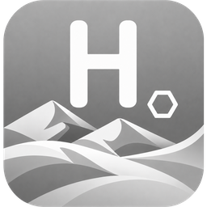
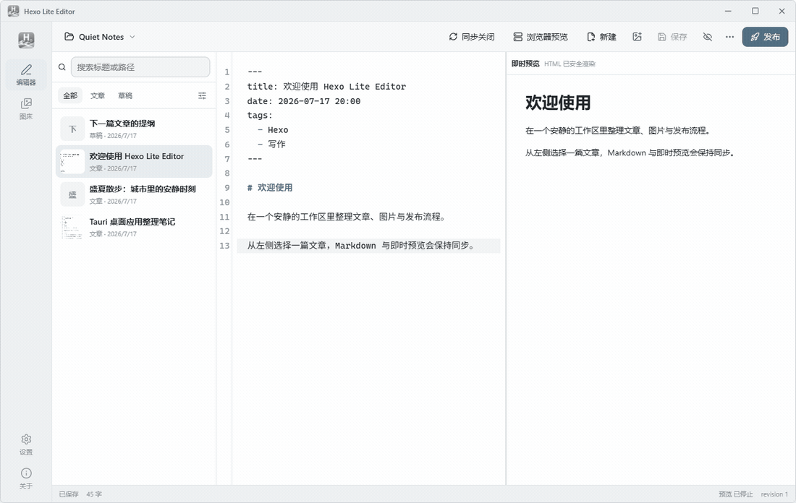
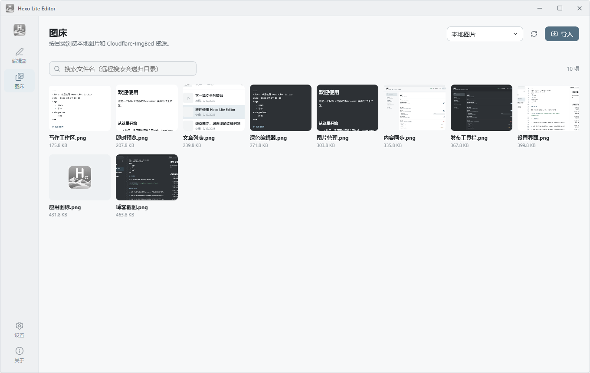
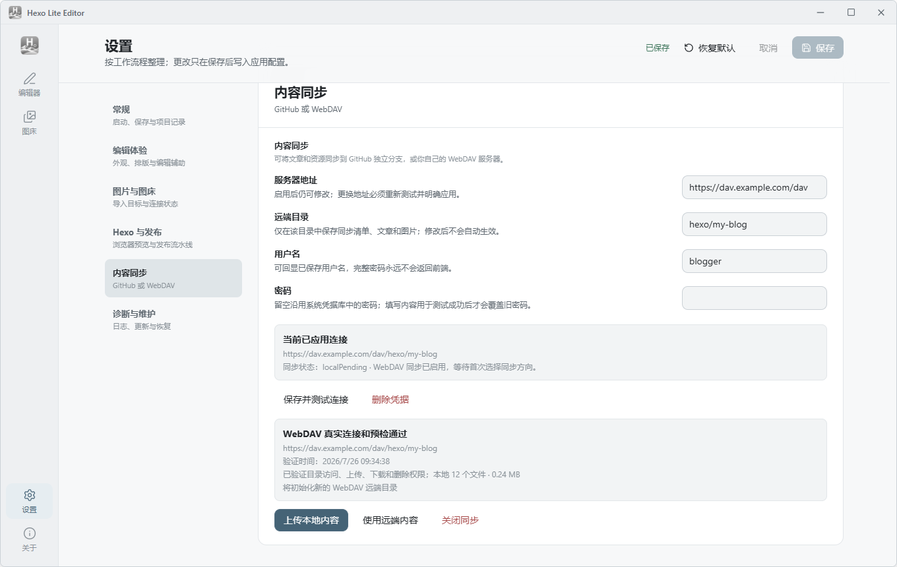
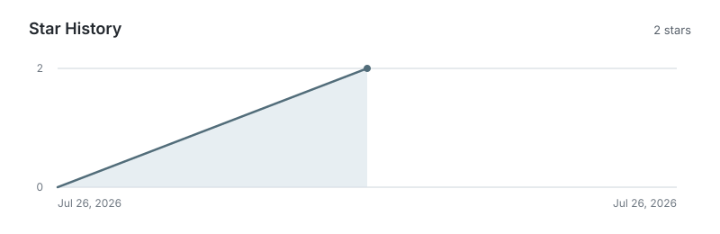

<div align="center">
  
  <h1>Hexo Lite Editor</h1>
  <p><strong>把 Hexo 写作、图片、预览与发布收进一个安静的桌面工作区。</strong></p>
  <p><a href="README.md">简体中文</a> · <a href="README_EN.md">English</a></p>
  <p>
    <a href="https://github.com/Bai-YB/hexo-lite-editor/releases/latest"></a>
    <a href="https://github.com/Bai-YB/hexo-lite-editor/stargazers"></a>
    <a href="https://github.com/Bai-YB/hexo-lite-editor/releases"></a>
    <a href="LICENSE"></a>
  </p>
  <p>
    <a href="https://github.com/Bai-YB/hexo-lite-editor/releases/download/v1.0.5/Hexo-Lite-Editor_1.0.5_windows-x64-setup.exe"><strong>Windows 安装版</strong></a>
    · <a href="https://github.com/Bai-YB/hexo-lite-editor/releases/download/v1.0.5/Hexo-Lite-Editor_1.0.5_windows-x64-portable.zip">便携版</a>
    · <a href="https://github.com/Bai-YB/hexo-lite-editor/releases/download/v1.0.5/Hexo-Lite-Editor_1.0.5_windows-x64.msi">MSI</a>
    · <a href="https://github.com/Bai-YB/hexo-lite-editor/releases/tag/v1.0.5">Release 与 SHA-256</a>
  </p>
  <sub>当前公开版本 v1.0.5 · Windows 10/11 x64</sub>
</div>

## 写作与即时预览

从左侧文章列表进入 Markdown，在中间写作，右侧即时查看经过安全清理的 HTML。需要更多空间时，隐藏预览会让编辑器真正占满文章列表之外的区域；需要核对主题时，再从同一工具栏打开真实 Hexo 页面。

<p align="center">
  
</p>

保存、浏览器预览、新建文章与发布都在当前上下文内完成，不需要在几个互不相关的页面之间来回切换。应用不内置 Node.js 或 Hexo，只有预览、生成和部署时才调用博客项目已有的环境。

<details>
<summary><strong>选择适合的 Windows 安装包</strong></summary>

| 包 | 适合场景 |
| --- | --- |
| 安装版 EXE | 日常使用；安装器可以补齐 WebView2 Runtime |
| 便携版 ZIP | 解压即用，不写入安装信息 |
| MSI | 企业部署或明确需要 MSI 的环境 |

项目暂未使用商业代码签名证书，Windows SmartScreen 可能显示“未知发布者”。请只使用本仓库 Release 中的文件，并与同一 Release 下的 `SHA256SUMS.txt` 核对。`v1.0.5` 暂未发布公开 macOS DMG；仓库保留了 macOS 通用构建工作流，可在 Mac 上生成 Intel 与 Apple Silicon 构建。
</details>

## 图片整理

本地图片、Cloudflare-ImgBed 资源、导入、粘贴和拖放使用同一套目录与 Markdown 前缀。资源页按真实目录浏览图片和其他文件，不需要把图床管理拆到浏览器标签页里。

<picture>
  <source media="(prefers-color-scheme: dark)" srcset=".github/assets/image-bed-dark.png">
  
</picture>

文章列表只读取 Front Matter 明确声明的 `cover`、`top_img`、`banner`、`thumbnail` 或 `index_img`。它不会拿正文第一张图猜封面，也不会在封面错误时偷偷换成默认图片。

## 同步与发布

内容同步支持隔离的 GitHub 内容分支，也支持自己的标准 WebDAV 服务。WebDAV 服务器、远端目录、用户名和密码始终保留在页面中；密码不会回显，新的凭据只有完成目录访问和可逆读写探针后才会进入系统凭据库。

<picture>
  <source media="(prefers-color-scheme: dark)" srcset=".github/assets/content-sync-dark.png">
  
</picture>

修改服务器或远端目录后必须重新测试并明确应用，不会自动上传或下载。首次连接需要选择“上传本地内容”或“使用远端内容”；后续冲突按文件处理，远端内容落地前会先创建本地备份。

## 能力与边界

| 工作 | 已覆盖 | 明确边界 |
| --- | --- | --- |
| 写作 | 文章与草稿、CodeMirror、独立滚动即时预览、浅色/深色/跟随系统 | 不是所见即所得编辑器 |
| 图片 | `source/` 下的本地图片、Cloudflare-ImgBed、粘贴/拖放/导入、错误占位 | 本地目录不能越过当前项目的 `source/` |
| 预览与发布 | 浏览器 Hexo 预览、clean、generate、deploy、Git 状态 | 不捆绑 Node.js、Hexo 或博客依赖 |
| 内容同步 | GitHub 隔离分支、WebDAV Basic Auth、哈希清单、冲突选择、拉取前备份 | 默认关闭，不同步草稿、站点配置、环境变量或凭据 |
| HTML 安全 | 常用语义 HTML、表格、图片和受限内联样式 | 脚本、事件属性、iframe、表单、SVG 和越界样式会被清理 |
| 系统 | 已发布 Windows 10/11 x64 包；仓库提供 macOS 构建工作流 | `v1.0.5` Release 当前没有公开 macOS 安装包 |

## 开始使用

1. 下载并启动安装版、便携版或 MSI。
2. 选择包含 Hexo `_config.yml` 的博客根目录。
3. 从左侧打开文章或草稿，编辑 Markdown 或支持的常用 HTML。
4. 使用即时预览检查正文；需要主题效果时点击“浏览器预览”。
5. 保存后点击“发布”，或从高级菜单单独运行 generate、deploy 等步骤。

本地写作不要求 Node.js。浏览器预览、generate 与 deploy 要求目标博客已经安装 Node.js、Hexo 和项目依赖。

## 安全与数据边界

- 即时预览由 DOMPurify 清理，并在生产构建中使用固定 CSP；代码围栏中的 HTML 始终按源码显示。
- Cloudflare 管理员密码只参与临时登录，Token 和 WebDAV 密码只保存在操作系统凭据库，不进入配置、日志或同步清单。
- 内容同步只处理 `source/_posts/`、文章同名资源目录和设置中指定的图片目录，并在覆盖本地内容前创建恢复备份。
- 本地图片路径拒绝绝对路径、`..` 和符号链接逃逸；远程图片直接交给 WebView 加载，保留系统缓存与连接复用。

<details>
<summary><strong>远程图片、错误状态与 HTML 细节</strong></summary>

HTTP/HTTPS 图片不会在后端逐张完整下载或解码校验。只要 WebView 能显示返回内容就按原样展示，包括服务器以 404 状态返回的有效图片体。空响应、网络失败或不可解码内容会在正文中显示保留尺寸的错误框，并在文章列表中显示图片错误图标；不会回退成默认封面，也不会在切换文章时短暂闪回原图。

即时预览支持常用排版、表格、`details/summary`、`figure/figcaption`、图片和受限内联样式，但不会执行脚本，也不接受 iframe、对象、表单、SVG 或 `<style>` 块。
</details>

<details>
<summary><strong>GitHub 与 WebDAV 内容同步细节</strong></summary>

GitHub 模式使用独立内容分支，不切换或修改项目当前分支。WebDAV 模式支持 HTTPS、Basic Auth、`PROPFIND`、`MKCOL`、`PUT`、`GET` 和 `DELETE`，以内容哈希命名不可变对象，最后条件更新 `.hexo-lite-sync.json`，避免并发设备静默覆盖。

候选 WebDAV 凭据只有在 Basic Auth、目录访问、上传、下载、删除探针和远端清单校验全部通过后才会保存。认证、网络、权限、只读目录、清单损坏和探针清理错误会保持为不同的可操作错误。
</details>

<details>
<summary><strong>快捷键</strong></summary>

| 快捷键 | 操作 |
| --- | --- |
| `Ctrl/⌘ + O` | 打开 Hexo 项目 |
| `Ctrl/⌘ + S` | 保存当前文章 |
| `Ctrl/⌘ + N` | 新建文章 |
| `Ctrl/⌘ + F` | 在编辑器中搜索 |
| `Ctrl/⌘ + Shift + P` | 发布当前博客 |
| `Ctrl/⌘ + ,` | 打开设置 |
| `Ctrl/⌘ + 1…4` | 切换编辑器、图床、设置和关于 |
| `↑ / ↓` | 在聚焦的文章列表中切换文章 |
</details>

<details>
<summary><strong>开发、验证与构建</strong></summary>

需要 Node.js、pnpm、Rust 和 Tauri 2 对应平台的构建依赖。

```bash
pnpm install
pnpm check
pnpm test
pnpm test:e2e
pnpm build
pnpm tauri dev
```

Rust 检查与桌面安装包构建：

```bash
cargo fmt --manifest-path src-tauri/Cargo.toml -- --check
cargo clippy --manifest-path src-tauri/Cargo.toml --all-targets --all-features -- -D warnings
cargo test --manifest-path src-tauri/Cargo.toml
pnpm tauri build
```

README 素材与本地 Star History 可以重复生成：

```bash
pnpm readme:assets
pnpm readme:stars -- --repository Bai-YB/hexo-lite-editor
```
</details>

## 项目动态



Star History 每周从 GitHub API 读取真实时间戳并在仓库内重新生成；没有 Star 时只显示零状态，不依赖外部图表服务，也不制造增长曲线。

[提交 Issue](https://github.com/Bai-YB/hexo-lite-editor/issues) · [查看 Releases](https://github.com/Bai-YB/hexo-lite-editor/releases) · [参与贡献](https://github.com/Bai-YB/hexo-lite-editor/pulls)

Hexo Lite Editor 使用 [MIT License](LICENSE) 发布。提交公开 Issue 时，请勿附带凭据或未经脱敏的诊断日志。
