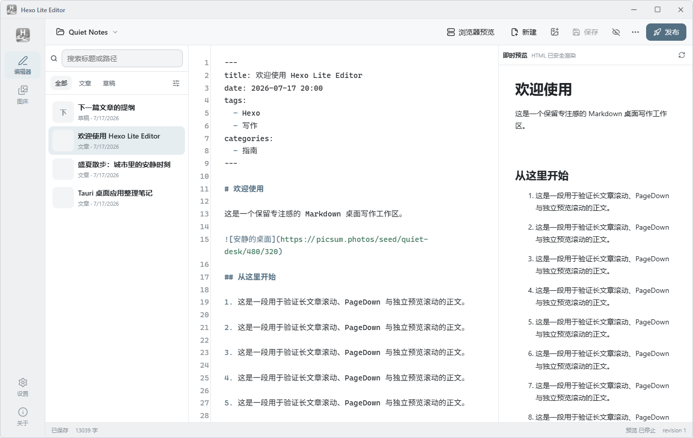
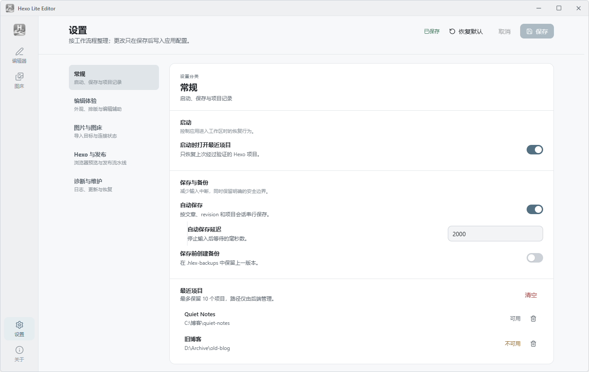
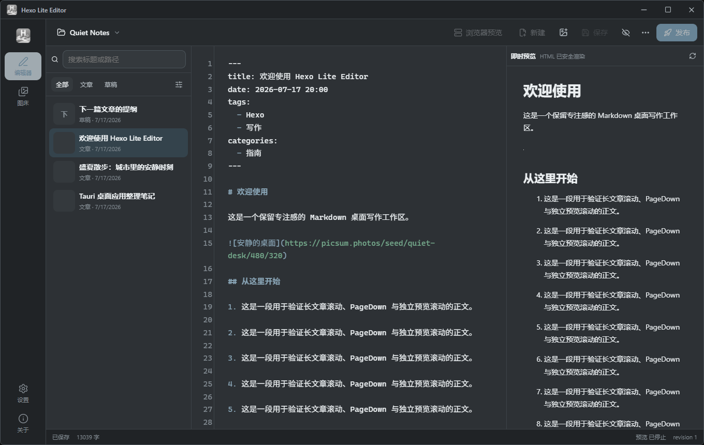
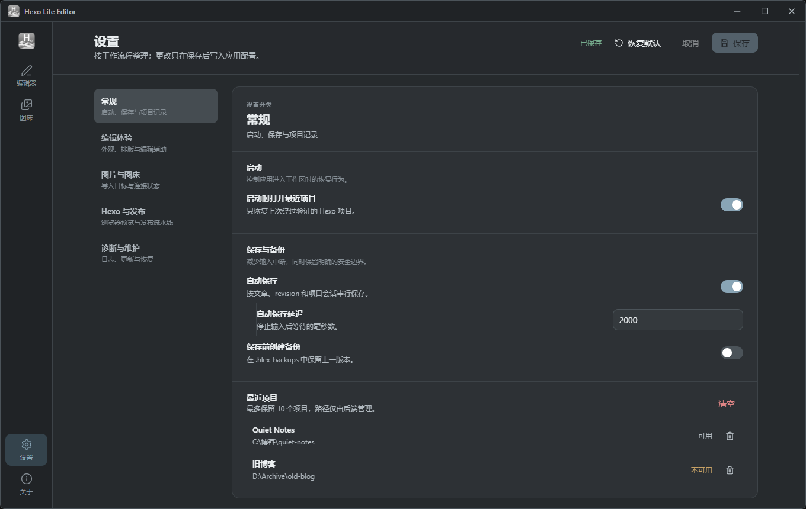

<div align="center">
  
  <h1>Hexo Lite Editor</h1>
  <p>安静、原生的 Windows Hexo 写作、图片管理与发布工作区。</p>
  <p><a href="README.md">简体中文</a> · <a href="README_EN.md">English</a></p>
  <p>
    <a href="https://github.com/Bai-YB/hexo-lite-editor/releases/latest"></a>
    <a href="https://github.com/Bai-YB/hexo-lite-editor/releases"></a>
    <a href="LICENSE"></a>
    <a href="https://github.com/Bai-YB/hexo-lite-editor/actions/workflows/release-windows.yml"></a>
  </p>
</div>

<picture>
  <source media="(prefers-color-scheme: dark)" srcset=".github/assets/editor-dark.png">
  
</picture>

Hexo Lite Editor 把文章编辑、即时预览、图片整理、Hexo 浏览器预览与发布任务收进一个专注的桌面界面。应用本身不内置 Node.js 或 Hexo；只有启动真实博客预览、生成或部署时，才会调用项目已有的环境。

## 下载

当前稳定版本为 **v1.0.3**，支持 Windows 10/11 x64。

| 版本 | 适合场景 | 下载 |
| --- | --- | --- |
| 安装版 EXE（推荐） | 日常使用；安装器可补齐 WebView2 | [下载安装版](https://github.com/Bai-YB/hexo-lite-editor/releases/download/v1.0.3/Hexo-Lite-Editor_1.0.3_windows-x64-setup.exe) |
| 便携版 ZIP | 解压即用，不写入安装信息 | [下载便携版](https://github.com/Bai-YB/hexo-lite-editor/releases/download/v1.0.3/Hexo-Lite-Editor_1.0.3_windows-x64-portable.zip) |
| MSI | 企业部署或需要 MSI 的环境 | [下载 MSI](https://github.com/Bai-YB/hexo-lite-editor/releases/download/v1.0.3/Hexo-Lite-Editor_1.0.3_windows-x64.msi) |

[查看完整 Release 与校验文件](https://github.com/Bai-YB/hexo-lite-editor/releases/tag/v1.0.3) · [版本记录](CHANGELOG.md)

> 项目暂未使用商业代码签名证书，Windows SmartScreen 可能显示“未知发布者”。请只从本仓库 Releases 下载，并用同一 Release 中的 `SHA256SUMS.txt` 校验文件。安装版会在需要时安装 Microsoft Edge WebView2 Runtime；便携版会引导到微软官方下载页。

## 为什么使用它

- **专注写作**：CodeMirror 编辑器、文章/草稿列表、独立滚动的安全即时预览，以及浅色、深色和跟随系统主题。
- **安全 HTML**：正文中的常用原生 HTML 可以正确渲染；脚本、事件属性、iframe、表单、危险 URL 与越界样式会被 DOMPurify 清理。代码围栏中的 HTML 仍按源码显示。
- **图片真实性优先**：Markdown 与 HTML 图片统一由 Rust 后端重新验证。远程图片被删除、返回无效 MIME 或网络状态无法确认时，预览显示“图片不可用”，不会回退到旧缓存。
- **本地图床可配置**：图片目录限定在 Hexo `source/` 下，Markdown 前缀可以按站点结构调整；导入、粘贴、拖放、列表与引用使用同一套配置。
- **CloudFlare-ImgBed 联动**：兼容 [CloudFlare-ImgBed v2.7.5](https://github.com/MarSeventh/CloudFlare-ImgBed/tree/v2.7.5)，可创建仅含上传、列出和删除权限的 Token。密码只用于临时登录，Token 仅存入系统凭据库。
- **可靠发布**：在编辑器中启动浏览器预览，或运行 clean、generate、deploy 与 Git 状态检查；保存与发布仍遵循项目自己的 Hexo 配置。
- **清楚的设置**：常规、编辑体验、图片与图床、Hexo 与发布、诊断与维护五个分类，一次只显示一组设置。

<details>
<summary><strong>查看更多真实界面截图</strong></summary>

<table>
  <tr>
    <td width="50%"><strong>图床资源管理</strong><br></td>
    <td width="50%"><strong>五分类设置</strong><br></td>
  </tr>
  <tr>
    <td width="50%"><strong>深色写作界面</strong><br></td>
    <td width="50%"><strong>深色设置界面</strong><br></td>
  </tr>
</table>
</details>

## 快速开始

1. 下载并启动安装版、便携版或 MSI。
2. 选择一个包含 Hexo `_config.yml` 的博客目录。
3. 从左侧文章列表打开文章，编辑 Markdown 或安全的常用 HTML。
4. 使用右侧即时预览检查正文；需要核对主题时，点击“浏览器预览”打开真实 Hexo 页面。
5. 保存后点击“发布”，或在高级菜单中单独运行 generate、deploy 等步骤。

应用启动和本地写作不要求 Node.js。浏览器预览、generate 与 deploy 要求目标博客已经安装 Node.js、Hexo 及项目依赖。

## 图片、HTML 与安全边界

即时预览允许常用排版、表格、`details/summary`、`figure/figcaption`、图片和受限内联样式，但不会执行脚本，也不支持 iframe、对象、表单、SVG 或 `<style>` 块。生产构建同时启用固定 CSP。

远程图片只允许无凭据 HTTPS，并会检查重定向、公网地址、真实 MIME 与大小；单图上限 25 MB，单批上限 64 MB。每次主动刷新、切换文章、重新聚焦窗口或图片地址变化时都会重新验证，响应和会话资产均采用 `no-store` 策略。

本地图片目录必须是 `source/` 下的相对路径，拒绝绝对路径、`..` 和符号链接逃逸。CloudFlare-ImgBed 管理员密码不会写入配置、日志或浏览器存储；删除本地 Token 不会远程撤销服务端 Token。

## 快捷键

| 快捷键 | 操作 |
| --- | --- |
| `Ctrl + O` | 打开 Hexo 项目 |
| `Ctrl + S` | 保存当前文章 |
| `Ctrl + N` | 新建文章 |
| `Ctrl + F` | 在编辑器中搜索 |
| `Ctrl + Shift + P` | 发布当前博客 |
| `Ctrl + ,` | 打开设置 |
| `Ctrl + 1…4` | 切换编辑器、图床、设置、关于 |
| `↑ / ↓` | 在聚焦的文章列表中切换文章 |

## 开发与构建

需要 Node.js、pnpm、Rust 和 Tauri 2 的 Windows 构建依赖。

```bash
pnpm install
pnpm check
pnpm test
pnpm test:e2e
pnpm build
pnpm tauri dev
```

Rust 检查与桌面安装包构建：

```bash
cargo fmt --manifest-path src-tauri/Cargo.toml -- --check
cargo clippy --manifest-path src-tauri/Cargo.toml --all-targets --all-features -- -D warnings
cargo test --manifest-path src-tauri/Cargo.toml
pnpm tauri build
```

生成安装版、MSI、便携版、SHA-256 和发行清单：

```powershell
pnpm release:windows
```

## 反馈与许可证

遇到可复现的问题，请提交 [Issue](https://github.com/Bai-YB/hexo-lite-editor/issues)，并附上系统版本、操作步骤和诊断日志中已脱敏的相关片段。安全问题请避免在公开 Issue 中提交凭据或未脱敏日志。

Hexo Lite Editor 使用 [MIT License](LICENSE) 发布。
